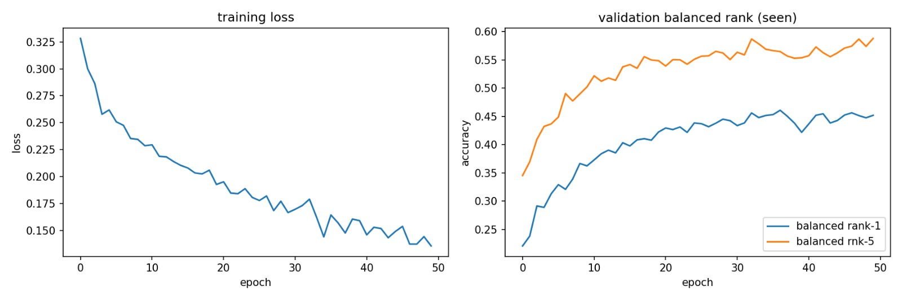

## Deep Learning and Computer Vision
Przemyslaw Swiat (s207257)

Muhammad Mashhood(s207125)

### AnimalCLEF 2025: Individual Animal Identification Report
#### Task: Individual Re-Identification:
Sea Turtles, Salamanders, and Lynxes.

### Task Description & Dataset

The challenge involves Individual Identification, a fine-grained visual recognition task where the goal is to determine if an animal in a query image has been seen before in the database or is a new individual.
- Species: Loggerhead sea turtles, Salamanders, and Eurasian lynxes. 
- The "New Individual" Problem: The model must output a specific identity for known animals or flag the animal as "new."
- Dataset: The primary dataset is relatively small, but participants can use WildlifeReID-10k (140k images, 10k individuals) for pre-training or augmentation. 
- Evaluation Metrics: 
  - BAKS: Balanced Accuracy on Known Samples. Measures how accurately the model identifies individuals already present in the database.
  - BAUS: Balanced Accuracy on Unknown Samples. Measures how accurately the model flags individuals that have never been seen before.
  - Final Score: Geometric Mean `√(BAKS×BAUS)`, penalizing models that fail at either identifying known individuals or detecting new ones.

### Proposed Approach
Our group developed a deep metric learning pipeline. Instead of standard classification, we trained the models to map images into an L2-normalized 128-dimensional hypersphere, where images of the same individual are pulled together and different individuals are pushed apart.
#### Core Components:
- Backbone: ResNet-50 / EfficientNet-B1.
- Loss Function: Batch Hard Triplet Loss. This samples the hardest positive and hardest negative within a batch to maximize the margin (0.3) between intra-class and inter-class distances.
- Data Splitting: A custom script was developed to handle the "Unseen" individual requirement, ensuring that certain individuals were entirely reserved for validation/testing to simulate "new" animal detection.
- Inference: Embeddings are extracted and compared using Euclidean distance.

#### Architecture Evolution
We compared two distinct backbones for our feature extractor:
- **Base Version**: Utilized ResNet-50, a standard workhorse for computer vision, known for its deep residual connections.
- **Extended Version**: Upgraded to EfficientNet-B1. This model uses compound scaling to achieve better accuracy with fewer parameters, providing more sophisticated feature maps for the subtle patterns on animal skin and shells.

### Modification and Upgrades 

#### I. Advanced Augmentation Pipeline
To prevent the model from memorizing specific images, we implemented a robust random augmentation strategy. This was crucial for the small core dataset:
- **Geometric Rotations:** Randomly applying 90°, 180°, or 270° rotations to handle varying camera orientations in the wild.
- **Photometric Jittering:** Drastic adjustments to Brightness, Contrast, and Saturation (factors ranging from 0.5 to 2.5). This forced the model to ignore lighting conditions and focus on biological markers (e.g., scute shapes or spot patterns).
- **Random Cropping:** Varying the scale (70%-95%) to simulate different distances between the camera and the animal.

#### II. Automated Hyperparameter Optimization (Grid Search)
In the Extended version, we moved beyond manual tuning. We implemented a Grid Search over the following search space:
**Sampling (M×K):** Testing different combinations of identities (M) and images per identity (K) per batch.
**Margin:** Adjusting the Triplet Loss margin (0.2 vs 0.3).
**Learning Rate:** Comparing 1e−4 and 1e−3. The grid search automatically selected the parameters that yielded the highest Rank-1 Accuracy on our validation set.

#### III. Centroid-Based Identification & Novelty Thresholding
We moved away from simple nearest-neighbor lookups to a Centroid Approach:
- For every known individual, we calculated a Centroid (the average embedding of all its training images).
- We then optimized a Harmonic Mean Threshold by testing 100 distance levels to find the "sweet spot" that best balances BAKS and BAUS.

### Modification Impact for Base and Extended model

| Modification                     | Impact  | Result/Observation                                                                                                    |
|----------------------------------|---------|----------------------------------------------------------------------------------------------------------------------|
| **ResNet-50 Backbone**               | High    | Provided a strong feature extractor for fine-grained textures (turtle shells/salamander spots).                      |
| **Batch Hard Sampling**              | Medium  | Improved convergence speed compared to random triplet selection.                                                     |
| **L2 Normalization**                 | High    | Essential for Triplet Loss to ensure embeddings live on a hypersphere, making distance metrics consistent.           |
| **Increased Epochs (50)**            | Low     | The model tended to plateau early; further gains required better sampling strategies rather than more iterations.    |

| Modification | Impact | Result / Observation |
| :--- | :--- | :--- |
| **EfficientNet-B1 Backbone** | Very High | Outperformed ResNet-50 by utilizing compound scaling. Captured finer morphological details (e.g., skin texture) with better parameter efficiency. |
| **Batch Hard Triplet Loss** | High | Essential for learning from "hard" examples; critical when individuals look nearly identical. |
| **Automated Grid Search** | High | New to Extended version. Eliminated guesswork for M (identities) and K (images); stabilized the embedding space. |
| **Centroid Representation** | Medium | Improved BAKS by providing a stable "average" identity per animal, reducing the impact of outliers. |

### Results Achieved

Training loss and validation balanced rank for both base and extended version are shared below respectively:

| Model Version | Backbone | Public Score | Private Score |
| :--- | :--- | :--- | :--- |
| **Base** | ResNet-50 | 0.10 | 0.07 |
| **Extended** | EfficientNet-B1 | 0.15 | 0.10 |

The transition to EfficientNet-B1 combined with automated hyperparameter tuning and heavy augmentation resulted in a 50% improvement in our public score.

The geometric mean metric was challenging; while our BAKS (identifying known individuals) was promising, the thresholding for BAUS (detecting "new" animals) proved to be the primary bottleneck in achieving a higher final score.

### Comparison & Top Performing Solutions

#### Comparison
Our score of 0.10 (Private) is currently below the top-tier solutions. This is primarily because our current implementation uses a fixed distance threshold for "new individual" detection, which is highly sensitive.

### Top Solution Analysis

Based on Kaggle discussions and similar Re-ID papers (like MegaDescriptor or BirdAware):

- **Heavy Pre-training**: Starting with models trained on the full WildlifeReID-10k dataset before fine-tuning on the specific species.
- **Vision Transformers (ViT)**: Top teams frequently use ViT-base or Swin Transformers, which capture global dependencies better than ResNet’s local convolutions. Combining a ResNet-based model with a Transformer-based model to capture both local textures and global shapes
- **Sub-center ArcFace**: Instead of Triplet Loss, top performers often use ArcFace or CosFace with sub-centers to handle the extreme class imbalance and intra-class variance in wildlife photography.
- **Orientation Normalization**: For turtles specifically, top solutions often include a preprocessing step to rotate the shell to a standard orientation using keypoint detection. Running multiple versions of a query image (flipped, rotated) through the model and averaging the embeddings to get a more stable prediction.
- **Ensembling**: Combining embeddings from models trained on different crops (e.g., full body vs. pattern-only) significantly boosts BAKS.

