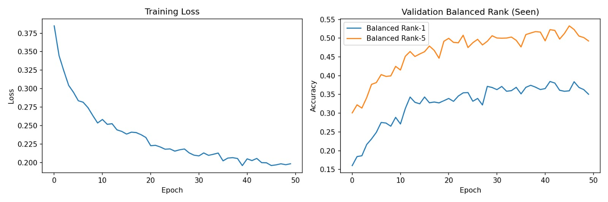

## Deep Learning and Computer Vision
Przemyslaw Swiat (s207257)

Muhammad Mashhood(s207125)

### AnimalCLEF 2025: Individual Animal Identification Report
#### Task: Individual Re-Identification:
Sea Turtles, Salamanders, and Lynxes.

### Task Description & Dataset

The challenge is Multi-species individual animal identification, a fine-grained visual recognition task where the goal is to determine if an animal in a query image has been seen before in the database or is a new individual. This is an open-set classificaiton problem with hundreds of classes. In the dataset, the number of images per individual varies significantly, leading to class imbalance and making the task more challenging. Some individuals have only one image, while others have hundreds.
- Species: loggerhead sea turtles, salamanders, and eurasian lynxes. 
- The "new individual" problem: The model must output a specific identity for known animals or flag the animal as "new."
- Dataset: The primary dataset is relatively small, but participants can use WildlifeReID-10k (140k images, 10k individuals) for pre-training or augmentation. 
- Evaluation Metrics: 
  - BAKS: Balanced Accuracy on Known Samples. Measures how accurately the model identifies individuals already present in the database.
  - BAUS: Balanced Accuracy on Unknown Samples. Measures how accurately the model flags individuals that have never been seen before.
  - Final Score: Geometric Mean `√(BAKS×BAUS)`, penalizing models that fail at either identifying known individuals or detecting new ones.

### Proposed Approach
Our group developed a simple, custom metric learning solution. Instead of standard classification, we trained the models to map images into an L2-normalized 128-dimensional hypersphere, where images of the same individual are pulled together and different individuals are pushed apart. We use a threshold to determine if a query image belongs to a known individual or is a new one based on the distance in the embedding space. 

#### Core Components:
- Architecture. A CNN-based feature extractor followed by a fully connected embedding layer. In the base version, as a backbone we used ResNet-50 with pre-trained weights on the IMAGENET dataset. Both the backbone and FC layers were trained during the training process.
- Loss Function. Batch Hard Triplet Loss. The goal is to maximize the distance between embeddings of different individuals and minimize the distance between embeddings of the same individual. This samples the hardest positive and hardest negative examples within a batch to form triplets for effective training.
- Preprocessing. Images were resized to 224x224 pixels, normalized using ImageNet statistics.
- Training. We used the Adam optimizer with a learning rate of 1e-4, M=8, K=4, margin=0.3, and trained for 50 epochs. We construct barches by uniformly sampling M individuals and K images per individual. If an individual has fewer than K images, we oversample with replacement. The augmentations are applied on-the-fly during training.
- Data Augmentation. Rotations by 90, 180, 270 degrees, color jittering (brightness, contrast, saturation), random cropping.
- Data Splitting. We split the dataset into train, validation, and test splits. A custom script was developed to handle the "unseen" individual requirement, ensuring that certain individuals were entirely reserved for validation/testing to simulate "new" animal detection.
- Inference: Centroids are computed for each individual in the training set. Query images are embedded and compared to these centroids using Euclidean distance.

### Architecture Evolution
#### I. Changed backbone to EfficientNet-B1
EfficientNet-B1 was chosen for its superior performance on image classification tasks with a good balance between accuracy and computational efficiency. This improved the model's ability to extract relevant features from the images, leading to better scores.

#### II. Automated Hyperparameter Optimization (Grid Search)
We implemented a grid search to optimize key hyperparameters:

**Sampling (M×K):** Testing different combinations of identities (M) and images per identity (K) per batch.

**Margin:** Adjusting the triplet loss margin (0.2 vs 0.3).

**Learning Rate:** Comparing 1e−4 and 1e−3. 

The grid search automatically selected the parameters that yielded the highest Rank-1 Accuracy on our validation set. The optimal parameters found were M=4, K=4, margin=0.3, and learning rate=1e−4.

#### III. More epochs
Training for 125 epochs instead of 50 allowed the model to converge better, especially with the more complex EfficientNet-B1 backbone.

### Results Achieved

Training loss and validation balanced rank for both base and extended version are shared below respectively:

*Base version*

*Extended version*

| Model Version | Backbone | Public Score | Private Score |
| :--- | :--- | :--- | :--- |
| **Base** | ResNet-50 | 0.10 | 0.07 |
| **Extended** | EfficientNet-B1 | 0.18 | 0.20 |

The transition to EfficientNet-B1 combined with automated hyperparameter tuning and heavy augmentation resulted in a 50% improvement in our public score.

The geometric mean metric was challenging; while our BAKS (identifying known individuals) was promising, the thresholding for BAUS (detecting "new" animals) proved to be the primary bottleneck in achieving a higher final score.

### Comparison & Top Performing Solutions

#### Comparison
Our private score of 0.18 is currently below the top-tier solutions. This is probably due to extreme simplicity of our approach. We also don't use a backbone pre-trained on wildlife datasets, which is a common practice among top performers. There is probably a lot of simple modifications that would improve performance.

### Top Solution Analysis

Based on Kaggle discussions and code shared by top participants, some good approaches are:

- **MegaDescriptor + Cosine Similarity:** Using MegaDescriptor architecture with cosine similarity for embedding comparison. It uses a single nearest-neighbor scheme and a fixed threshold. This pipeline achieves ~30% on the public leaderboard. Link: https://www.kaggle.com/competitions/animal-clef-2025/writeups/ionut-visan-0-62300-solution

- **WildFusion fusion of MegaDescriptor + Aliked:** This is an extended version of the previous approach, which incorporates local feature matching. Both MedaDescriptor and Aliked pipelines are extended with Isotonic calibration. WildFusion combines both pipelines outputs to form a single prediction. It achieves 51% on the public leaderboard. Link: https://www.kaggle.com/competitions/animal-clef-2025/writeups/ionut-visan-0-62300-solution

- **Fusion of MegaDescriptor + ConvNeXt:** Ensemble model approach that combines predictions from two different types of computer vision architectures: MegaDescriptor and ConvNeXt. It also uses a hard threshold.  It achieves 62% on the public leaderboard. Link: https://github.com/visan-ionut/Animal_Clef_2025/blob/main/Code/AnimalCLEF25_CVPR_FGVC_%26_LifeCLEF.ipynb
